# TkSwarm 业务逻辑与流程图

> 来源：本地参考 `http://localhost:8399`、重建 `http://127.0.0.1:8400`、`refers/page_*.html`、官网 tkswarm.com  
> 缺口与分期见 [`plan.md`](./plan.md)

---

## 0. 两边架构对照

### 0.1 参考系统（8399）运行结构

```mermaid
flowchart TB
  subgraph Client[TKSwarm 客户端 UI :8399]
    Login["/page/index 登录"]
    Acc["/page/account 账号管理"]
    Proxy["/page/proxy 代理IP"]
    Agent["/page/agent AI机器人"]
    Pub["/page/publish AI矩阵"]
    Chat["/page/chat 客服聊天"]
    Set["/page/settings 系统设置"]
  end

  subgraph API[业务 API]
    TkAcc["/api/tk-account/*"]
    TkChat["/api/tk-chat/*"]
    TkIp["/api/tk-ip/* + /tiktok/ip/*"]
    Task["/api/task/*"]
    AgApi["/api/agent/*"]
    Mon["/api/account-monitor/*"]
    SetApi["/api/tk-setting/*"]
    User["/api/user/*"]
  end

  subgraph Realtime[实时]
    WS["/websocket/chat"]
    Conn["/api/websocket/connections/*"]
  end

  subgraph Ext[外部依赖]
    Bit[比特浏览器]
    CapCut[CapCut]
    Studio[TikTok Studio]
    CloudIP[云代理]
    LLM[AI/翻译服务]
  end

  Login --> User
  Acc --> TkAcc
  Acc --> Conn
  Proxy --> TkIp
  Agent --> AgApi
  Pub --> Task
  Chat --> TkChat
  Chat --> WS
  Set --> SetApi
  Acc --> Bit
  Pub --> Bit
  Pub --> CapCut
  Pub --> Studio
  Proxy --> CloudIP
  Agent --> LLM
  Chat --> LLM
```

### 0.2 当前系统（8400）运行结构

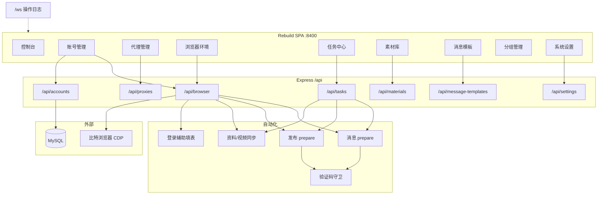

### 0.3 能力覆盖对比（逻辑视角）

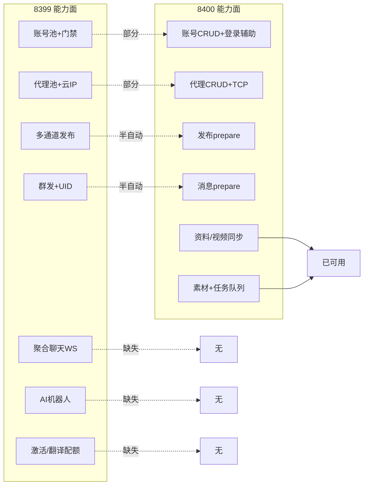

---

## 1. 产品总闭环（参考业务）

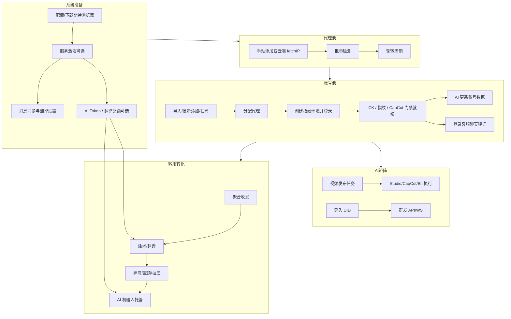

---

## 2. 账号上线运营链路

### 2.1 参考侧（8399）

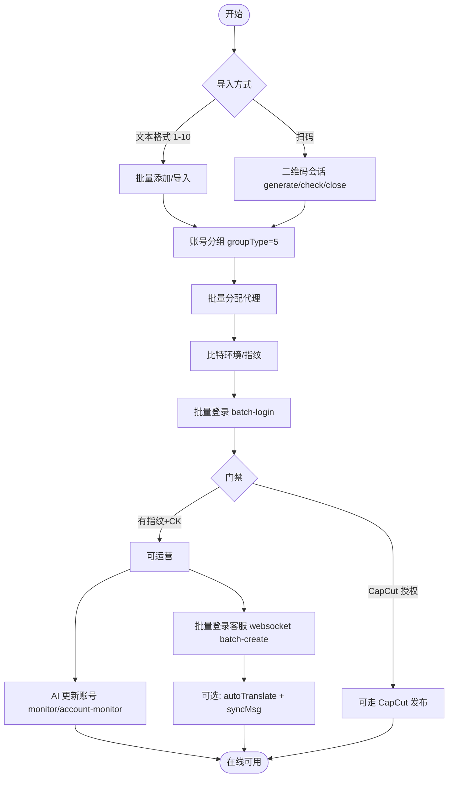

### 2.2 当前侧（8400）实际路径

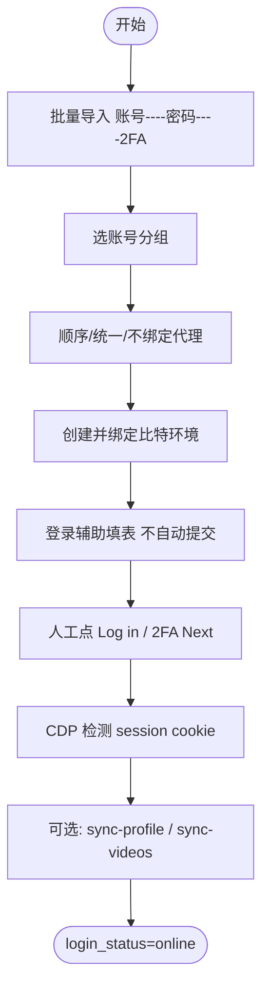

### 2.3 账号状态机

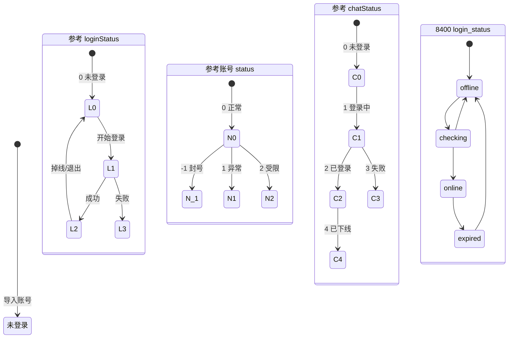

### 2.4 账号批操作逻辑（参考）

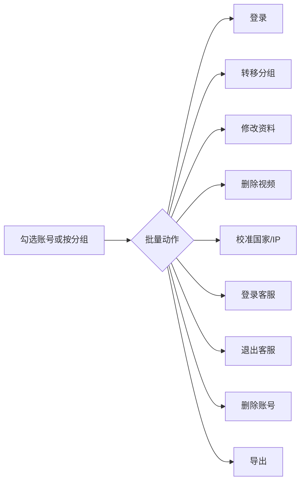

---

## 3. 代理 IP 链路

### 3.1 参考侧

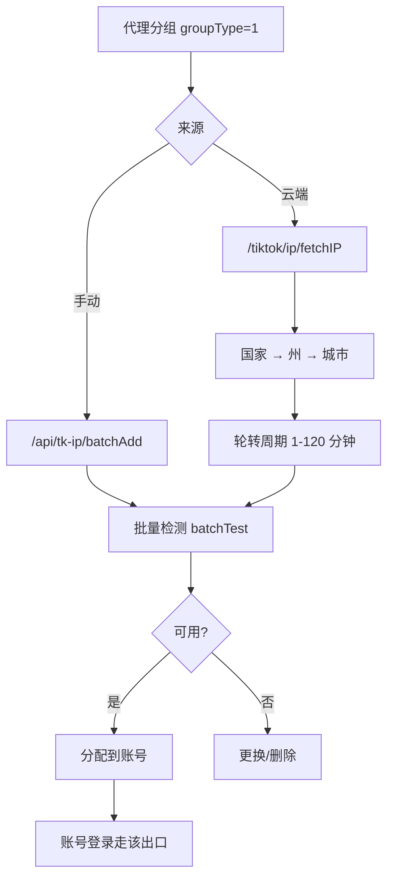

### 3.2 当前侧

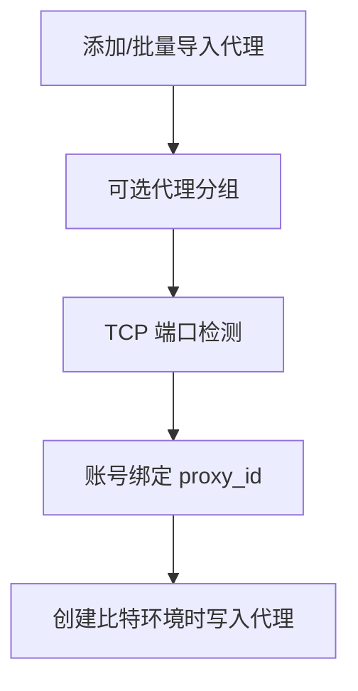

---

## 4. 矩阵视频发布链路

### 4.1 参考侧向导（AI矩阵 · 视频任务）

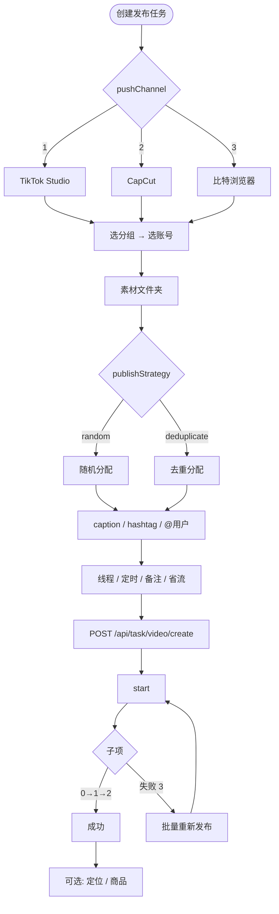

### 4.2 当前侧（半自动）

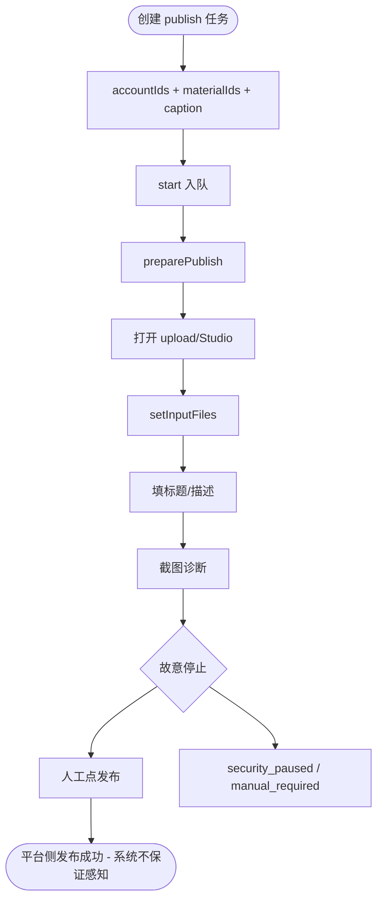

### 4.3 任务状态机

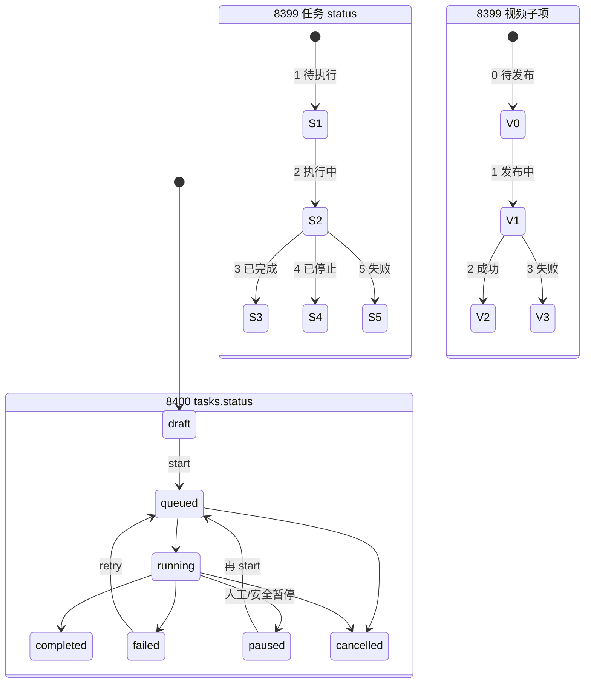

---

## 5. 矩阵群发链路

### 5.1 参考侧

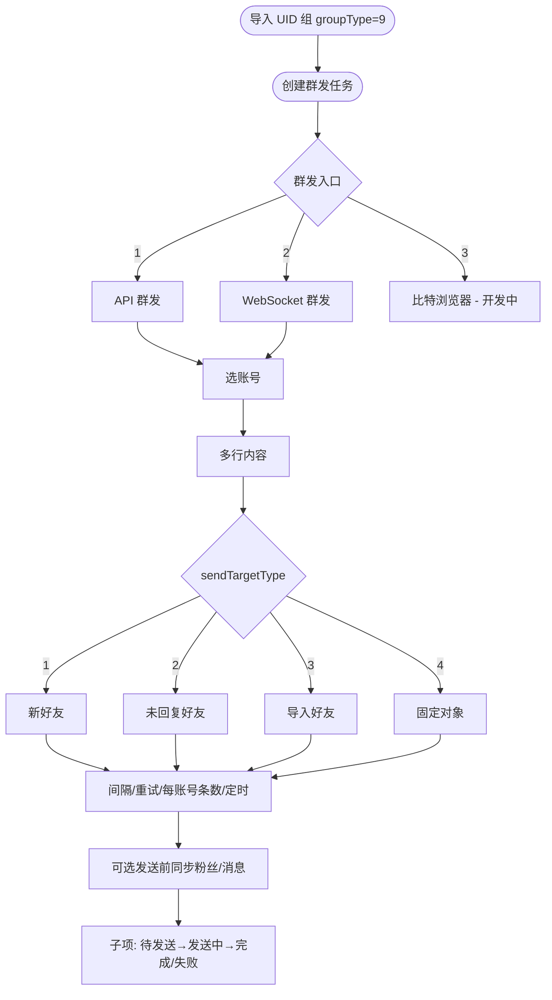

### 5.2 当前侧

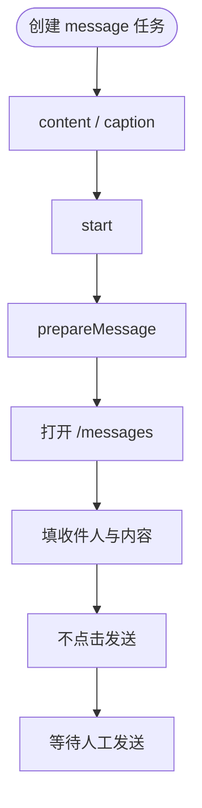

### 5.3 UID 资源流（参考）

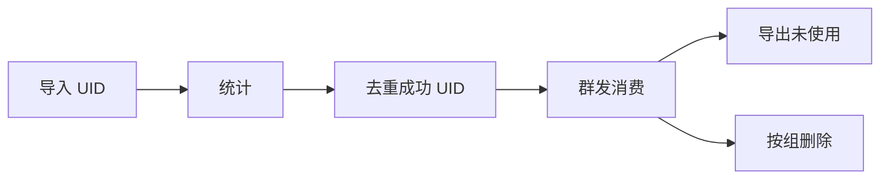

---

## 6. 客服聊天链路

### 6.1 连接与收发（参考）

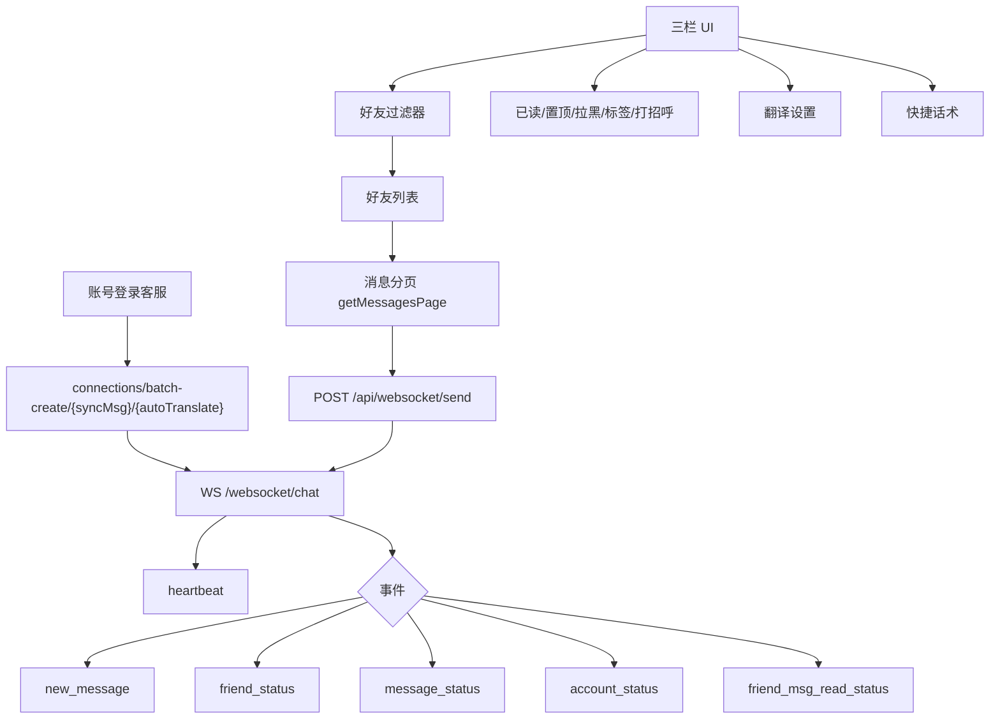

### 6.2 好友筛选逻辑（参考）

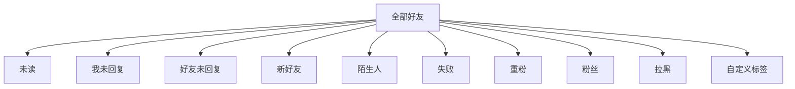

### 6.3 消息类型（参考）

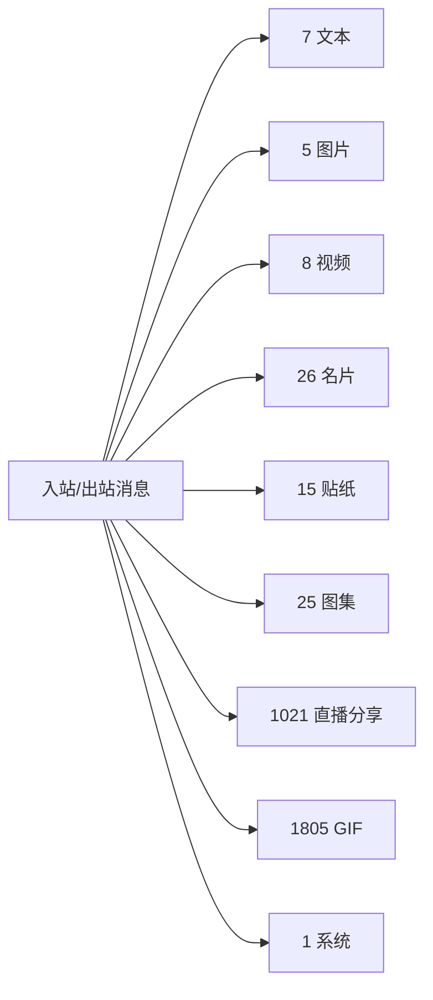

### 6.4 当前侧差距

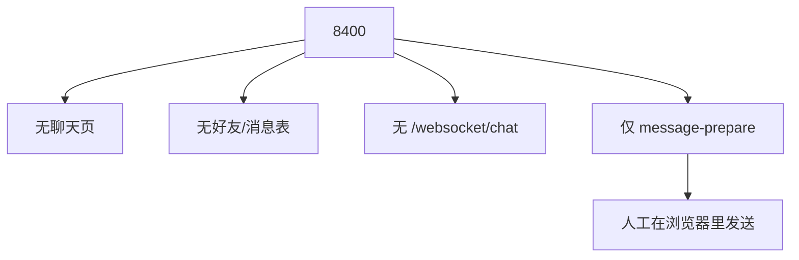

---

## 7. AI 机器人与转化链路

### 7.1 参考侧 Agent 配置流

```mermaid
flowchart TD
  A0([创建智能体]) --> Base[头像/名称/描述/启停]
  Base --> Model{modelType}
  Model -->|0| BuiltIn[内置模型]
  Model -->|1| CustomAPI[自定义 API]
  Model -->|2| CustomAgent[自定义智能体]
  BuiltIn --> Dialog[开场白/角色/目标/规则/语气/温度]
  CustomAPI --> Dialog
  CustomAgent --> Dialog
  Dialog --> Term[成功/失败终止条件]
  Term --> Poll[号码轮询 TG/Line/WA 或推广链接]
  Poll --> Test[testChat]
  Test --> Save[save]
```

### 7.2 托管会话逻辑（目标态；参考 AI托管仍标开发中）

```mermaid
flowchart TD
  Msg[收到粉丝私信] --> Bind{会话是否绑定 Agent?}
  Bind -->|否| Human[人工/话术]
  Bind -->|是| AI[调用 Agent]
  AI --> Match{命中终止?}
  Match -->|成功关键词| OK[成功回复 + 下发资源]
  Match -->|失败关键词| Fail[失败回复并结束]
  Match -->|否| Reply[AI 回复继续聊]
  Reply --> Msg
  OK --> End([结束或转人工])
  Fail --> End
```

---

## 8. 系统设置与底座

### 8.1 参考设置结构

```mermaid
flowchart TB
  Set[系统设置] --> Br[浏览器设置]
  Set --> Act[服务激活]
  Set --> Msg[消息设置]
  Set --> Clock[多国时钟]
  Set --> DB[(数据库配置-隐藏)]

  Br --> Bit[browserType=bit]
  Br --> Headless[无头: scan/message/capcut/login/profile/publish]
  Br --> Cache[清缓存/语言/省内存]

  Act --> Lic[软件套餐]
  Act --> Tr[翻译字符配额]
  Act --> Tok[AI Token]
  Act --> IpCard[IP 更换次卡]

  Msg --> Sync[私信同步间隔]
  Msg --> Sound[提示音]
  Msg --> Mode[translateMode normal|ai]
```

### 8.2 当前设置结构

```mermaid
flowchart LR
  S[settings] --> K1[browserType / browserApiUrl / token]
  S --> K2[taskConcurrency / timeout / batchInterval / maxRetries]
  S --> K3[messageSyncInterval]
  S --> K4[useSystemProxy]
  S --> K5[language]
  K2 -.->|部分未消费| Runner[task-runner]
  K3 -.->|未消费| X[无聊天同步]
```

---

## 9. 端到端主路径对照

### 9.1 参考：从 0 到发布 + 聊天

```mermaid
sequenceDiagram
  participant U as 用户
  participant UI as 8399 UI
  participant API as 业务API
  participant Bit as 比特浏览器
  participant TT as TikTok
  participant WS as Chat WS

  U->>UI: 登录系统
  U->>UI: 设置浏览器 / 导入代理
  U->>UI: 导入账号并分配代理
  UI->>API: batch-login / 扫码
  API->>Bit: 打开环境
  Bit->>TT: 登录拿会话
  U->>UI: 创建发布任务
  UI->>API: task/video/create + start
  API->>Bit: 按通道上传发布
  Bit->>TT: 发布视频
  U->>UI: 批量登录客服
  UI->>API: websocket connections batch-create
  API->>WS: 建立账号连接
  WS-->>UI: new_message
  U->>UI: 回复/话术/翻译
  UI->>API: websocket/send
```

### 9.2 当前：从 0 到半自动准备

```mermaid
sequenceDiagram
  participant U as 用户
  participant UI as 8400 UI
  participant API as Express API
  participant Bit as 比特浏览器
  participant TT as TikTok

  U->>UI: 直接进入后台(无登录)
  U->>UI: 导入代理/账号
  U->>UI: 批量创建环境
  UI->>API: /api/browser/accounts/batch-create
  API->>Bit: 创建 profile + 代理
  U->>UI: 登录辅助
  UI->>API: login-assist
  API->>Bit: CDP 填表
  U->>TT: 人工点击登录
  U->>UI: 创建 publish 任务并 start
  UI->>API: /api/tasks/:id/start
  API->>Bit: preparePublish
  Bit->>TT: 打开上传并填表
  API-->>UI: manual_required / paused
  U->>TT: 人工点击发布
  Note over U,TT: 无聚合聊天、无群发自动发送、无 AI 机器人
```

---

## 10. 分组类型与实体关系

### 10.1 参考 groupType

| 值 | 用途 |
|----|------|
| 1 | 代理池 |
| 5 | 账号池 |
| 8 | 话术分类 |
| 9 | 群发 UID/好友组 |

### 10.2 当前 groups.type

| 值 | 用途 | 前端 |
|----|------|------|
| account | 账号分组 | 有 |
| proxy | 代理分组 | 有 |
| message | 消息分组 | Tab 有，业务弱 |
| uid | UID 分组 | **无 UI** |

### 10.3 核心实体关系（目标对齐参考）

```mermaid
erDiagram
  GROUPS ||--o{ ACCOUNTS : account_group
  GROUPS ||--o{ PROXIES : proxy_group
  GROUPS ||--o{ UID_TARGETS : uid_group
  GROUPS ||--o{ MSG_MODELS : message_category
  PROXIES ||--o{ ACCOUNTS : binds
  ACCOUNTS ||--o| BROWSER_PROFILE : has
  ACCOUNTS ||--o{ TASK_ITEMS : executes
  ACCOUNTS ||--o{ FRIENDS : chats
  FRIENDS ||--o{ MESSAGES : has
  ACCOUNTS ||--o| CHAT_CONNECTION : online
  MATERIALS ||--o{ TASK_ITEMS : used_by
  TASKS ||--o{ TASK_ITEMS : contains
  AGENTS ||--o{ FRIENDS : optional_host
  ACCOUNTS ||--o{ TIKTOK_VIDEOS : owns
  ACCOUNTS ||--o| TIKTOK_PROFILES : syncs
```

---

## 11. 模块依赖顺序（实施时逻辑依赖）

```mermaid
flowchart TD
  B0[浏览器 Provider 稳定] --> B1[账号登录态/门禁]
  B1 --> B2[代理真实可用]
  B2 --> B3[发布执行器]
  B1 --> B4[聊天连接与收发]
  B4 --> B5[群发 + UID]
  B4 --> B6[翻译]
  B6 --> B7[AI 机器人 / 托管]
  B3 --> B8[Studio/CapCut 通道]
  B1 --> B9[账号监控与统计]
  B4 --> B10[话术/标签运营]
  B0 --> B11[无头功能位/多浏览器]
```

与 [`plan.md`](./plan.md) 中 Phase A→F 一致：先发布与聊天闭环，再群发与 AI，最后生产化。

---

## 12. 附录：本地实测快照

| 项 | 8399 | 8400 |
|----|------|------|
| 根路径 | 登录页「TKSwarm - 登录」 | Rebuild 控制台 |
| 业务页 | account/proxy/agent/publish/chat/settings 均 200 | 单页 SPA 九视图 |
| 鉴权 | 业务 API 401 | 无鉴权 200 |
| 健康 | `/actuator` 200；无 `/api/health` | `/api/health` 200，version 0.1.0 |
| 页面内功能词 | 扫码/CapCut/群发/AI托管/激活/翻译等齐全 | 无 AI/翻译/扫码/CapCut/聊天 WS |
| 数据示例 | 需登录后可见 | 8 账号 online、100 代理、1 条 paused 发布任务、比特 API offline |

*文档随实现推进应同步更新状态机与「当前侧」流程图。*
